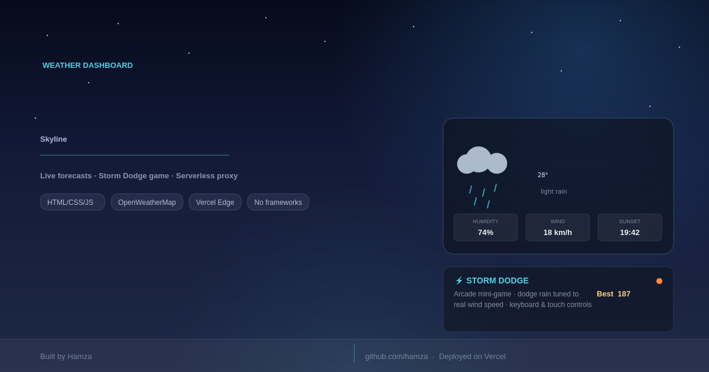

<div align="center">
  
</div>

# Skyline

A weather dashboard where the background *is* the data — sky, particles, and light all driven by the live OpenWeatherMap response for whatever city you search. Includes **Storm Dodge**, a canvas mini-game that uses the real wind speed to decide how fast things fall.

## Features

- Animated sky (rain, snow, stars, drifting clouds, sun) that reacts to real conditions, not a static theme
- 5-day forecast, feels-like / humidity / wind / sunset readout
- City search with debounced autocomplete, plus geolocation
- °C / °F toggle, results cached per session
- Storm Dodge — dodge live rain or snow, tuned to the actual wind speed

## Stack

Vanilla HTML/CSS/JS, no build step. Vercel Edge Functions proxy the OpenWeatherMap API so the key never reaches the browser.

## Running locally

```bash
npm i -g vercel
git clone https://github.com/raman-ah/weather-app
cd weather-app
cp .env.example .env   # add your OPENWEATHER_API_KEY
vercel dev
```

Free key at [openweathermap.org/api](https://openweathermap.org/api).
## Deployed
https://weather-app-ecru-three-90.vercel.app

<sub>Built by Hamza</sub>
